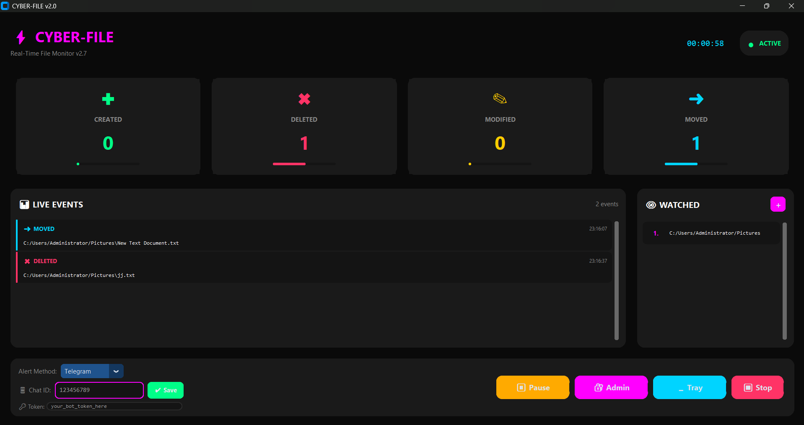
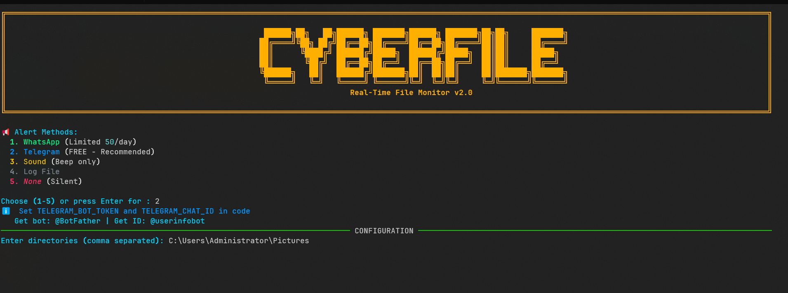
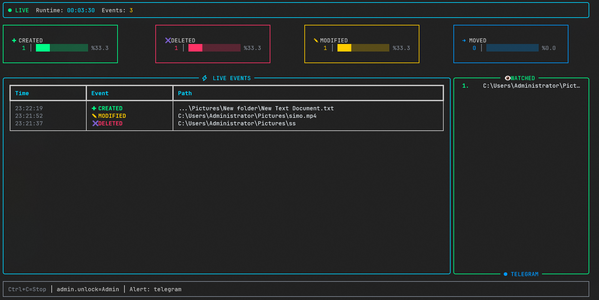

# 🔒 CYBER-FILE v2.7


**Real-Time File Monitoring Tool** with Modern GUI, Multi-Alert System, and System Tray Integration.



---

## 🗺️ Application Workflow (Mindmap)

<p align="center">
  
</p>

---
---

---
## 📋 Table of Contents

- [Features](#-features)
- [Installation](#-installation)
- [Telegram Bot Setup](#-telegram-bot-setup)
- [Usage](#-usage)
- [Admin Mode](#-admin-mode)
- [Build EXE](#-build-exe)
- [Troubleshooting](#-troubleshooting)

---
---


---
## ✨ Features

| Feature | Description |
|---------|-------------|
| 🔍 **Real-Time Monitoring** | Track file creations, deletions, modifications, moves instantly |
| 📱 **Telegram Alerts** | Get notifications on your phone via Telegram Bot |
| 💬 **WhatsApp Alerts** | Alternative alerts via Twilio (optional) |
| 🎨 **Modern GUI** | Dark cyber theme with CustomTkinter |
| 🗕️ **System Tray** | Run in background, minimize to tray |
| 📊 **Live Dashboard** | Real-time statistics and event timeline |
| 🔐 **Admin Mode** | Hidden console with security code |
| 🔊 **Sound Alerts** | Beep on critical events (optional) |

---

## 🚀 Installation

### Step 1: Download Cyber-File

**Option A: Download EXE (Windows)**
- Go to [Releases](https://github.com/simo-SM/cybr-file1/releases)
- Download `Cyber-File_Setup.exe`
- Double-click to run.

**Option B: Run from Python Source**

```bash
# 1. Clone repository
git clone [https://github.com/simo-SM/cybr-file1.git](https://github.com/simo-SM/cybr-file1.git)
cd cybr-file1

# 2. Create virtual environment
python -m venv venv

# 3. Activate environment
# Windows:
venv\Scripts\activate

# 4. Install dependencies
pip install -r requirements.txt

# 5. Run application
python cyberfile_v2.7.py
