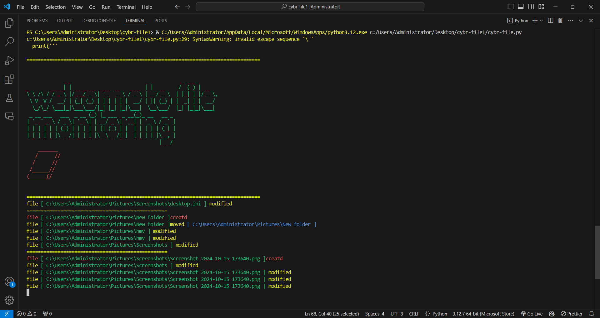

# Cyber-File:
### CLI Interface

The CLI of Ara tube Downloader.
## Overview
Cyber-File is a Python script that monitors a specified directory for file system events such as creation, deletion, modification, and movement of files. It provides real-time feedback in the console using colored text for better visibility.

## Features
Monitors a specified directory for changes.
Displays messages for created, deleted, modified, and moved files.
Color-coded terminal output for clarity.
Requirements
Python 3.x
watchdog library
termcolor library
Installation
Clone the repository:

```bash```
git clone <repository_url>
cd <repository_directory>
Install the required libraries:

```bash```
pip install watchdog termcolor
Usage
Open the script in your preferred Python IDE or text editor (e.g., Visual Studio Code).

Update the path variable to the directory you wish to monitor.

## python:
path = "C:\\Users\\Administrator\\Pictures"
Run the script:

```bash```

## python cyber_file.py
Use ( Ctrl + C )to stop the script.

Example Output:
==================================================
file [ C:\Users\Administrator\Pictures\example.jpg ] created
file [ C:\Users\Administrator\Pictures\example.png ] deleted
file [ C:\Users\Administrator\Pictures\example.txt ] modified
file [ C:\Users\Administrator\Pictures\example.docx ] moved [ C:\Users\Administrator\Documents\example.docx ]
==================================================
